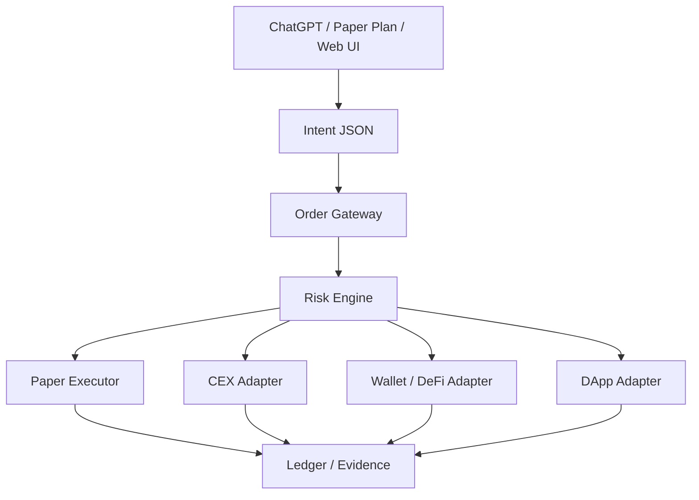

# ChatGPT発注・送金システム全体構想 v0.1

ページ作成日時：2026-08-05 09:43 JST
最終更新日時：2026-08-05 09:43 JST

## 目的

佐藤がChatGPT経由で暗号資産の取引・送金を指示できるようにする。ただし、ChatGPTが秘密鍵や取引所API Secretを直接持つのではなく、ChatGPTは意図と注文票を生成し、実行はSC法人用の発注ゲートウェイが検証・記録・実行する。

この文書は、ここまで話した「実現したい内容」の全体構想を記録する正本である。詳細仕様は `docs/order_gateway_v0.1.md` と `templates/intent_schema_v0.1.json` に分ける。

## 実現したいこと

- ChatGPTから、取引所、ウォレット、DeFi、DAppに対する取引・送金指示を出せるようにする。
- 別チャットで始めたPaper Trade Planも、同じ発注ゲートウェイに流して検証できるようにする。
- 実発注とpaper tradeを、注文票上の設定で切り替えられるようにする。
- 安全装置は原則として設定化し、検証段階では厳格、必要に応じて段階的に緩和できるようにする。
- 実行された取引・送金は、約定価格、取引所手数料、実際にかかったガス代、approval関連費用、TxHash、注文ID、JPY換算額、証憑IDまでGoogle SheetsのSC暗号資産会計元帳に記録する。
- MetaMask/DEX/DeFi/DApp取引は、オンチェーン証憑ルール `docs/onchain_tx_evidence_v0.1.md` に接続する。
- 秘密鍵、seed phrase、API Secret、2FA情報はGitHub、Notion、ChatGPT、Google Sheetsに置かない。

## 基本アーキテクチャ

## 役割分担

| 領域 | 役割 | 持ってよい情報 | 持たせない情報 |
|---|---|---|---|
| ChatGPT | 意図整理、注文票生成、根拠説明、paper検証 | ルール、注文票、公開価格、過去の検証結果 | API Secret、秘密鍵、seed phrase |
| Order Gateway | Intent受付、スキーマ検証、リスク判定、実行ルーティング | API接続名、許可設定、実行ログ | seed phrase、復旧情報 |
| Risk Engine | 金額上限、損失上限、銘柄/チェーン/送金先許可、確認要否判定 | safety設定、日次使用額、保有枠 | 秘密鍵 |
| Paper Executor | 実発注なしの約定仮定・検証ログ作成 | market snapshot、paper ledger | 実行権限 |
| CEX Adapter | bitFlyer/Coincheck等の注文・取消・約定取得 | 環境変数またはSecret Manager上のAPI情報 | GitHub上のAPI Secret |
| Wallet/DeFi Adapter | quote取得、approval確認、未署名Tx生成、TxHash取得 | wallet address、chain、contract address | private key |
| Ledger/Evidence Writer | Google Sheets元帳と証憑管理への記録 | 取引実績、TxHash、JPY換算、証憑ID | seed phrase、API Secret |

## 実行モード

| `execution_mode` | 内容 | v0.1方針 |
|---|---|---|
| `paper` | 実発注しない。注文票、判定、paper ledgerだけ作る | 初期値 |
| `shadow` | 実市場quoteを取得し、発注せず検証する | v0.2以降 |
| `live_confirmed` | 発注前に佐藤の明示確認を必須にする | CEX/DeFiの初期実発注候補 |
| `live_auto` | 設定条件内なら自動実行する | 初期は非推奨。Hard Guardは残す |

## 対象レーン

| `venue_type` | 対象 | 初期実装 |
|---|---|---|
| `cex` | Coincheck / bitFlyer等の取引所 | paper、注文票、約定ログ設計 |
| `wallet` | MetaMask等からの送金 | 送金Intentと証憑ルール設計 |
| `defi` | Uniswap / 0x等のswap | quote onlyから開始 |
| `dapp` | 任意DApp操作 | 最後に扱う。初期は原則disabled |
| `manual` | 佐藤が手動実行した取引の記録 | 元帳・証憑登録に対応 |

## 安全装置の考え方

安全装置はon/off可能なものと、ChatGPTや通常設定からはoffにしないものを分ける。

| 区分 | 設定変更 | 例 |
|---|---|---|
| Soft Guard | Intentまたは管理設定で変更可 | 成行禁止、スリッページ上限、ガス上限、1回上限、日次上限、最大損失上限 |
| Policy Guard | 管理画面または設定ファイルで変更可 | 銘柄ホワイトリスト、取引所許可、チェーン許可、DeFiプロトコル許可 |
| Hard Guard | ChatGPTからoff不可 | 秘密鍵非保持、出金先アドレス帳、送金確認、任意DApp calldata確認、監査ログ、証憑必須 |

## SC運用上の上位制約

| 項目 | 方針 |
|---|---|
| 取引主体 | SC法人 |
| 初期資金 | 1,000,000円 |
| 現金待機 | 原則55%。投資判断の上位制約として扱う |
| 投資枠 | 原則45%。CEX/MetaMask/予備枠に配分 |
| 最大損失 | 1回あたり10,000円以内を原則 |
| 基準通貨 | JPY |
| 時刻基準 | JST |
| 記録正本 | Google Sheetsの暗号資産会計元帳 |

## 元帳記録方針

対象Google SheetはREADME記載の `暗号資産会計元帳` とする。発注ゲートウェイは、実行結果を `01_取引明細` と `06_証憑管理` に記録できる形式で保存する。

| 実行結果 | `01_取引明細` への記録 |
|---|---|
| CEX約定 | 約定日時JST、取引所、注文ID、銘柄、入出数量、約定単価、手数料、JPY換算額、証憑ID |
| DeFi Swap | TxHash、支払資産、取得資産、約定価格、ガス代数量/通貨/JPY、DEX quote/receipt、証憑ID |
| Approval | token移転は発生しないため、原則としてガス費のみの行として記録。対象Swapと証憑IDで紐づける |
| Wallet送金 | TxHash、送金元/送金先ラベル、資産、数量、ガス代、証憑ID |
| Failed Tx | ガス費のみ記録し、チェックを `要確認` にする |
| Paper Trade | 実約定ではないことを明示し、paper ledgerまたは取引明細の対象外/別管理にする |

実値が取れない項目は推定補完しない。`チェック=要確認` として残し、後で証憑から確認する。

## 初期実装フェーズ

1. `paper` 専用Gatewayを作る。
2. ChatGPT/Paper Planから `Intent JSON` を生成する。
3. `templates/intent_schema_v0.1.json` で構文検証する。
4. Risk Engineで金額・損失・銘柄・チェーン・証憑要件を判定する。
5. paper ledgerと運用ログに保存する。
6. DeFiはquote取得だけにする。
7. MetaMask署名が必要なものは、佐藤が画面で確認して手動署名する。
8. 実発注は `live_confirmed` から開始し、すべて元帳・証憑に反映する。
9. DApp任意実行は最後に扱う。

## 未確定事項

- Google Sheets元帳へ直接追記する実装をGoogle Sheets APIで行うか、CSV/JSON出力を人間確認後に取り込むか。
- CEX実発注を先に作るか、DeFi quote adapterを先に作るか。
- live execution用のホストをdevbox、VPS、Cloud Run等のどこに置くか。
- API Secret保管先をOS環境変数、Secret Manager、Vault等のどれにするか。
- `live_auto` を許可する条件をどこまで狭くするか。

## 更新履歴

- 2026-08-05 09:43 JST：ChatGPT経由の取引・送金システム全体構想を作成。