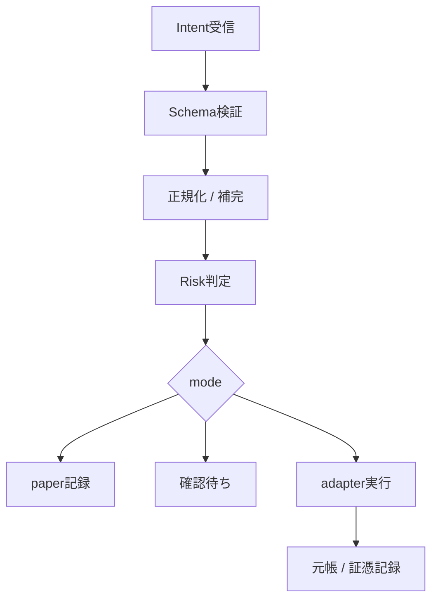

# Gateway Adapter / Order Gateway v0.1 仕様

ページ作成日時：2026-08-05 09:43 JST
最終更新日時：2026-08-05 10:21 JST

## 目的

ChatGPT、Paper Plan、Web UI、手動入力から渡される暗号資産取引・送金の意図を、共通の `Intent JSON` として受け取り、paper trade、CEX実発注、Wallet送金、DeFi swap、DApp操作へ安全にルーティングする。

v0.1では実発注システムそのものよりも、次を固定する。

- Intentの受付形式
- 実発注/paper tradeの切替
- safety設定の扱い
- Risk Engineの判定順
- CEX/Wallet/DeFi/DApp adapterの責務境界
- Google Sheets元帳と証憑管理へ残す実行ログ形式

## 入出力

| 区分 | 内容 |
|---|---|
| 入力 | `gateway-adapter/intent-schema-v0.1.json` に従うIntent JSON |
| 出力 | `accepted` / `rejected` / `needs_confirm` / `paper_recorded` / `submitted` / `executed` / `failed` のGateway Event |
| 記録 | Gateway Event、Risk判定、quote、confirmation、execution result、ledger write result |
| 正本 | 実取引・送金の会計正本はGoogle Sheetsの暗号資産会計元帳 |

## 処理フロー



## 処理順

1. `intent_id` と `schema_version` を確認する。
2. JSON Schemaで構文検証する。
3. JST日時、銘柄表記、chain、venue、金額単位を正規化する。
4. `execution_mode` を読む。
5. `safety_profile` と個別 `safety_toggles` を読む。
6. Hard Guardを先に適用する。
7. Policy Guardを適用する。
8. Soft Guardを適用する。
9. 必要に応じてquote/precheckを取得する。
10. `paper` なら実発注せずpaper記録を作る。
11. `live_confirmed` なら確認画面へ回す。
12. `live_auto` でもHard Guardは解除しない。
13. adapter実行後、実値を元帳・証憑管理に記録する。
14. 実値が欠ける場合は `チェック=要確認` にする。

## execution_mode

| mode | 説明 | 発注 | 初期許可 |
|---|---|---:|---:|
| `paper` | 実発注なし。注文票と判定結果のみ記録 | なし | Yes |
| `shadow` | 実市場quoteを取り、発注せず検証 | なし | Later |
| `live_confirmed` | 人間確認後に実行 | あり | Later |
| `live_auto` | 条件内なら自動実行 | あり | No |

## venue_type

| type | adapter | v0.1方針 |
|---|---|---|
| `cex` | CEX Adapter | 注文票・約定ログ仕様を先に固定 |
| `wallet` | Wallet Adapter | 送金Intentと証憑ルールを固定。手動確認必須 |
| `defi` | DeFi Adapter | quote onlyから開始。署名はMetaMask/Safeで手動 |
| `dapp` | DApp Adapter | 初期disabled。calldataの人間確認必須 |
| `manual` | Manual Recorder | 手動実行済み取引を元帳・証憑へ流す |

## safety_profile

| profile | 内容 |
|---|---|
| `strict` | 初期値。確認・上限・ホワイトリスト・証憑必須 |
| `normal` | 一部Soft Guardを緩和 |
| `custom` | 個別 `safety_toggles` を読む |
| `danger` | Soft Guardの多くをoffにできるが、Hard Guardは残す |

## safety_toggles

| toggle | 区分 | 初期値 | 説明 |
|---|---|---:|---|
| `require_manual_confirm` | Soft/Policy | true | 実発注・送金前に確認を要求 |
| `enable_market_order` | Soft | false | 成行注文を許可するか |
| `enforce_max_order_jpy` | Soft | true | 1注文あたり上限を適用 |
| `enforce_daily_limit_jpy` | Soft | true | 日次上限を適用 |
| `enforce_max_loss_jpy` | Soft | true | 最大損失上限を適用 |
| `enforce_slippage_bps` | Soft | true | スリッページ上限を適用 |
| `enforce_gas_jpy_max` | Soft | true | ガス代上限を適用 |
| `enforce_cash_reserve_ratio` | Policy | true | 現金待機比率を守る |
| `require_asset_whitelist` | Policy | true | 許可銘柄のみ取引 |
| `require_chain_whitelist` | Policy | true | 許可チェーンのみ利用 |
| `require_venue_whitelist` | Policy | true | 許可venueのみ利用 |
| `require_address_whitelist` | Hard | true | 送金先アドレス帳を必須にする |
| `block_private_key_handling` | Hard | true | 秘密鍵・seed phraseを扱わない |
| `require_audit_log` | Hard | true | すべての判定と実行を監査ログに残す |
| `require_evidence` | Hard | true | 実行後の証憑記録を必須にする |
| `require_dapp_calldata_review` | Hard | true | 任意DApp calldataの人間確認を必須にする |

Hard Guardは、ChatGPTからのIntentや通常の管理設定ではoffにしない。

## Risk Engine判定

| 判定 | 内容 | reject条件 |
|---|---|---|
| schema | 必須フィールド、型、enum | schema違反 |
| mode | `execution_mode` が許可されているか | 未許可mode |
| venue | venue/chain/protocolが許可されているか | 未許可venue/chain |
| asset | 銘柄/contract addressが許可・確認済みか | 未確認contract |
| amount | `amount_jpy`、数量、日次累計が上限内か | 上限超過 |
| loss | `max_loss_jpy` が上限内か | 10,000円超など |
| slippage | `slippage_bps_max` が上限内か | 上限超過 |
| gas | `gas_jpy_max` が上限内か | 上限超過 |
| reserve | 現金待機55%を崩さないか | 待機比率割れ |
| evidence | 証憑が残せる取引か | 証憑不可 |
| address | 送金先がアドレス帳にあるか | 未登録送金先 |
| dapp | calldataやapprove先が確認可能か | 不明なDApp操作 |

## Adapter責務

### Paper Executor

- 実発注しない。
- Intent、判定結果、参照価格、仮定約定価格、検証期限を記録する。
- 元帳の実取引とは混ぜない。必要ならpaper専用ログまたは `records/trade_plans/` に残す。

### CEX Adapter

- 対象：Coincheck、bitFlyer等。
- 発注前に残高、最小注文数量、価格、手数料見込みを確認する。
- 約定後に実約定価格、約定数量、手数料、注文IDを取得する。
- 実値だけを元帳へ渡す。未約定・部分約定は状態を分ける。

### Wallet Adapter

- 対象：MetaMask等からの送金。
- Gatewayは送金Intentと未署名Txまたは確認用情報を作る。
- 署名は佐藤がMetaMask/Safe等で確認して行う。
- 実行後、TxHash、ガス代、送金先ラベル、Explorer URLを記録する。

### DeFi Adapter

- 対象：Uniswap、0x等。
- v0.1ではquote取得までを基本とする。
- swap実行時は、quote、slippage、approval要否、gas見込み、送信先contractを表示する。
- approvalが発生した場合は、approval Txを独立したガス費行として元帳に記録し、swap本体と証憑IDで紐づける。

### DApp Adapter

- 初期はdisabled。
- 任意DAppのcalldataは人間確認必須。
- token approval、delegate、permit、bridge、claim等は個別risk ruleを追加するまで自動実行しない。

## Gateway Event

| event | 意味 |
|---|---|
| `intent_received` | Intentを受信した |
| `schema_validated` | JSON Schemaに通った |
| `risk_rejected` | Risk Engineで拒否された |
| `needs_confirm` | 人間確認待ち |
| `paper_recorded` | paper記録が完了した |
| `quote_received` | quote/precheckを取得した |
| `submitted` | 取引所APIまたはwalletへ送信した |
| `executed` | 約定またはTx成功を確認した |
| `failed` | 失敗した |
| `ledger_recorded` | 元帳・証憑管理へ記録した |
| `ledger_needs_review` | 元帳記録に未確認項目がある |

## 元帳書き込み契約

実行済みの取引・送金は、Google Sheetsの `01_取引明細` と `06_証憑管理` に接続できる実行結果JSONとして保存する。

### 必須実値

| 項目 | 内容 |
|---|---|
| `executed_at_jst` | 約定またはTx成功日時JST |
| `venue` | 取引所/ウォレット/DEX/DApp |
| `order_id` | 取引所注文ID。該当なしならnull |
| `tx_hash` | オンチェーンTxHash。該当なしならnull |
| `base_asset` / `quote_asset` | 取引対象 |
| `in_amount` / `out_amount` | 実際に入った数量、出た数量 |
| `executed_price` | 実約定価格 |
| `executed_price_currency` | JPY/USD/USDT等 |
| `fee_amount` / `fee_asset` / `fee_jpy` | 取引所手数料 |
| `gas_amount` / `gas_asset` / `gas_jpy` | 実際に支払ったガス代 |
| `approval_fee_jpy` | approval関連Tx費用。approval Txが別行なら関連IDを持つ |
| `jpy_rate` | 換算に使ったJPYレート |
| `jpy_amount` | 取引本体のJPY換算額 |
| `evidence_id` | `06_証憑管理` と対応するID |
| `check_status` | `OK` / `要確認` / `対象外` |

### Google Sheets列対応

| 実行結果 | `01_取引明細` の列 |
|---|---|
| 約定日時 | `約定日時(JST)` |
| venue | `取引所/ウォレット` |
| 注文ID/TxHash | `注文ID / TxHash` |
| 銘柄 | `銘柄` |
| 入出数量 | `入数量`、`入通貨`、`出数量/金額`、`出通貨` |
| 約定価格 | `約定単価`、`約定単価通貨`、`JPYレート` |
| JPY換算 | `JPY換算額` |
| 取引所手数料 | `手数料数量`、`手数料通貨`、`手数料JPY` |
| ガス代 | `ガス代数量`、`ガス代通貨`、`ガス代JPY` |
| 理由/条件 | `取引理由`、`損切り条件`、`利確条件` |
| 証憑 | `証憑ID` |
| 未確認点 | `備考`、`チェック` |

## approval feeの扱い

- ERC-20 approveはtokenの取得/譲渡ではない。
- 実際に発生するのはガス費なので、原則として `取引区分=Gas`、`売買区分=NONE` の独立行にする。
- approval対象のswap/bridge/claimがある場合は、同じ `evidence_id` または備考の関連IDで紐づける。
- approval feeをswap本体に合算する場合でも、元のapproval TxHashは必ず残す。

## 設定例

```json
{
  "execution_mode_default": "paper",
  "safety_profile_default": "strict",
  "cash_reserve_ratio_min": 0.55,
  "max_order_jpy": 100000,
  "max_loss_jpy": 10000,
  "daily_limit_jpy": 150000,
  "gas_jpy_max": 3000,
  "slippage_bps_max": 100,
  "allowed_venue_types": ["cex", "wallet", "defi", "manual"],
  "disabled_venue_types": ["dapp"],
  "hard_guards": {
    "block_private_key_handling": true,
    "require_address_whitelist": true,
    "require_audit_log": true,
    "require_evidence": true,
    "require_dapp_calldata_review": true
  }
}
```

## v0.1完了条件

- `Intent JSON` がschemaで検証できる。
- `paper` Intentを受け付け、Risk判定結果とpaper記録を残せる。
- `live_confirmed` Intentは確認待ち状態までで止められる。
- CEX/DeFi/Wallet/DAppのadapter責務が分かれている。
- 実行済み取引・送金の結果を、Google Sheets元帳の列へ対応付けられる。
- approval fee、gas fee、約定価格、TxHash、証憑IDの記録ルールが固定されている。

## 更新履歴

- 2026-08-05 10:21 JST：Gateway Adapter配下へ移動し、Intent Schema参照パスを更新。
- 2026-08-05 09:43 JST：Order Gateway v0.1仕様を作成。